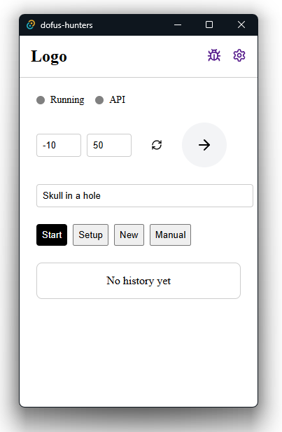

# DOFUS-hunteRS  
[](#)  
[](https://www.rust-lang.org/)  
[](https://tauri.app/)  
[](#)  
[](LICENSE)  

```
   ____        __              __     __
/ __ \____  / /_____  ____  / /_   / /____  _____
/ / / / __ \/ __/ __ \/ __ \/ __/  / __/ _ \/ ___/
/ /_/ / /_/ / /_/ /_/ / / / / /_   / /_/  __/ /    
\____/ .___/\__/\____/_/ /_/\__/   \__/\___/_/     
/_/   hunteRS ~ Tauri Desktop App ~
```

> **Dofus overlay tool** (inspired by Ganymède) – Not a bot, just an assistive tool for treasure hunts in Dofus.  
> ⚠️ *Currently English-only. Private API. Still a work in progress!*

---

## 📌 Overview

- **Demo VIDEO**:
- [](https://www.youtube.com/watch?v=yhh_wEjSPN8)

- **Screenshot**: 
- 
  

---

## 🚀 Features

- **Dofus overlay**: Screen analysis with OCR and OpenCV.  
- **Clue management**: Fetches hints from your custom API.  
- **Built-in settings manager**: Configure directly from the app.  
- **Rust + Tauri**: Fast, lightweight, and smooth desktop experience.  
- **Inspired by Ganymède**: But with extra Rust magic!  

---

## ⚡ Installation & Requirements

### 1. Microsoft C++ & WebView2
- Install **Microsoft C++ Build Tools** and **Microsoft Edge WebView2** (required for Tauri).

### 2. Rust & Tauri
- Install [Rust](https://www.rust-lang.org/tools/install) and set the MSVC toolchain as default.
- (Optional) Install [Node.js](https://nodejs.org/) if you plan to tweak the frontend.
- Ensure Tauri is installable via `cargo`.

### 3. OpenCV (Required for OCR)
- Install via **Chocolatey**:  
  ```powershell
  choco install llvm opencv
  ```
- Or via **vcpkg**:
  ```powershell
  vcpkg install llvm opencv4[contrib,nonfree]
  ```
- Set environment variables (`OPENCV_LINK_PATHS`, etc.).

### 4. Clang/LLVM
- Download the latest version from [LLVM releases](https://github.com/llvm/llvm-project/releases).
- Add paths to environment variables (`LLVM_CONFIG_PATH`, `LIBCLANG_PATH`).

---

## 🛠 Running the App (Dev)

1. **Clone the repo**:
   ```bash
   git clone https://github.com/LightInn/dofus-hunteRS.git
   cd dofus-hunters
   ```
2. **Install dependencies**:
   ```bash
   pnpm install
   ```
   (or `npm install`, `yarn install` – whichever you prefer)
3. **Start in dev mode**:
   ```bash
   pnpm tauri dev
   ```
4. **Configure settings directly in the app** (Settings tab).

---

## ⚠️ Important Notices

> **🔴 OCR cannot be disabled**  
> The app relies on OpenCV-based OCR, and there are currently no native Rust bindings available to replace it.

> **🔴 English-only for now**  
> The tool only works with the **English** version of Dofus.

> **🔴 This is NOT a bot**  
> The app does not automate gameplay. It simply provides an assistive overlay for easier treasure hunts.

> **🔴 Work in Progress**  
> Expect bugs, incomplete features, and frequent updates.

---

## 🤝 Contributing

Pull requests are more than welcome! Whether it's improving the UI, optimizing the OCR, or porting the project to other OS, your contributions can make a difference.  
Open an **issue** or a **pull request** and let’s discuss!

---

## 📜 License

This project is open-source under the **MIT License**. See the [LICENSE](LICENSE) file for details.

---

## 🎉 Credits

- **Tauri** for making desktop dev enjoyable.
- **Rust** for its unmatched speed.
- **Dofus community** for the inspiration.
- **You**, for testing and contributing!

---

*Happy hunting! (And remember, we're not bots.)*
```